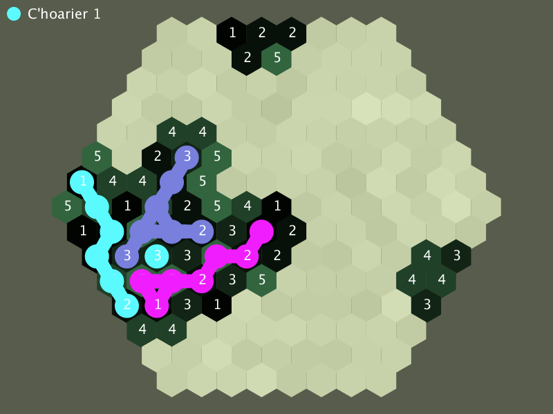

## 1 Meurzh 2023

Betek poent e c'heller c'hoari un taol n'eus forzh pelec'h war an tablez, memes an taol kentañ, padal e rankfe bezañ berzet taolioù 'zo. Da skouer, taol kentañ pep c'hoarier a rankfe bezañ war vord an tablez nemetken. Pep taol da-heul a rank bezañ stok diouzh tiriadoù perc'hennet dija.
Er fonksion <code>mousePressed</code> (galvet bep gwech ma vez kliket en ul lec'h bennak war ar prenestr), ar varienn <code>is_valid_move</code> a servijo deomp da wiriekañ ma'z eo bet graet un taol aotreet gant ar c'hoarier, pe get. Lakaet e vo an talvoud <code>False</code> gant ar varienn-se, dre ziouer.

### Berzañ an taol kentañ

Er c'hlasad (class) <code>Choarier</code> e vez kavet ur varienn <code>n_taol</code> evit mirout soñj eus an niver a daolioù a zo bet c'hoariet gant pep hini.
Bep gwech ma kliket war ur gellig vo tu sellet ouzh stad ar varienn-se, ha ma'z eo kevatal da 0 (taol kentañ) e vo aotreet da aloubiñ an tiriadoù war ar bord nemetken. Gouezet e vez ez eo un tiriad war ar bord p'en deus nebeutoc'h eget 6 amezeg (<code>len(Kellig.amezeien) < 6</code>)

```python
# Galvet bep gwech ma vez kliket er prenestr
def mousePressed():
    global n_choarier   # niverenn ar c'hoarier
    
    if tostan:
        # Kliket eo bet war ur c'hellig
        # Liammet eo bet ar c'hellig-se d'ar varienn 'tostan'
        
        is_valid_move = False
        if tostan.dizoloet and tostan.aloubet_gant == None:
            # Aloubet e vez ar c'hellig
            # ...
            is_valid_move = True
        elif not tostan.dizoloet:
            if choarierien[n_choarier].n_taol == 0 and len(tostan.amezeien) < 6:
                # Taol kentañ
                # ...
                is_valid_move = True
            
        if is_valid_move:
            # Dizoloiñ ar c'helligoù tro-dro
            # ha tremen d'ar c'hoarier da-heul
            # ..
```

### Diskouez an tiriadoù liammet

Evit ma teufe war vel gwelloc'h tiriadoù pep c'hoarier e vez treset ur c'helc'h liv ar c'hoarier dindan talvoud pep tiriad. Evit diskouez splannoc'h hollad an tiriadoù hag al liammoù etre pep kellig e tresimp linennoù tev etre pep kellig hag e amezeien, gant ma vezont aloubet gant ar memes c'hoarier.

Trugarez da Matilin ha Paolig da vezañ labouret war ar c'hod-se !

```python
class Kellig:
    # ...
    
    def draw(self):
        # Fonksion galvet evit tresañ pep kellig
        
        if self.dizoloet:
            # ...
            if self.aloubet_gant != None:
                # Tresañ merk liv ar c'hoarier n'eus aloubet ar c'hellig mañ
                
                pushStyle()  # envoreniñ stad ar "style" (liv, tevder a linennoù...)
                # ...
                for k in self.amezeien:
                    if self.aloubet_gant == k.aloubet_gant:
                        # Al linenn etre ar c'hellig-mañ ar ur c'hellig amezeg eus ar memes liv
                        line(self.pos.x, self.pos.y, k.pos.x, k.pos.y)
                popStyle()  # gervel ar "style" kozh en dro
            
            text(self.value, self.pos.x-5, self.pos.y+5) # Talvoud skrivet a-us ar c'hellig
        else:
            # tresañ ur c'hellig el latar
            # ...
```


